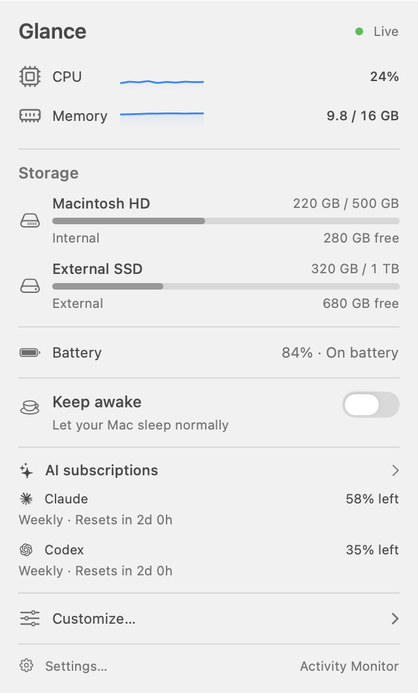
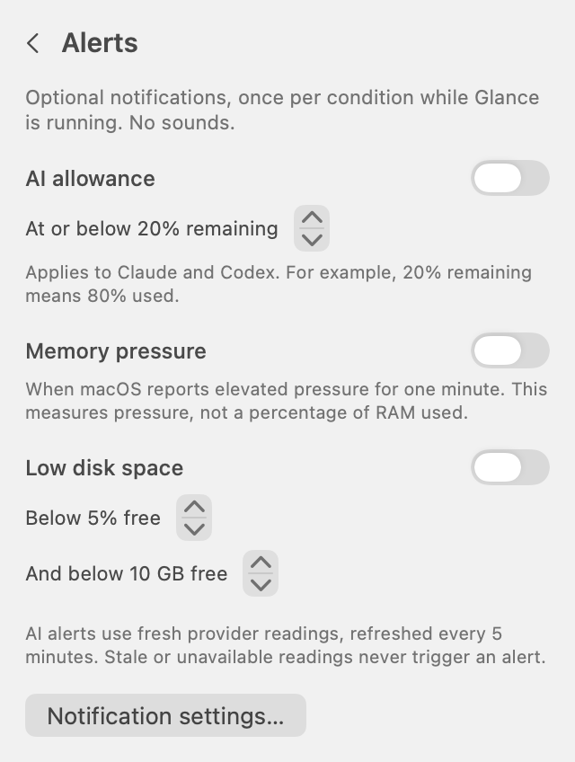
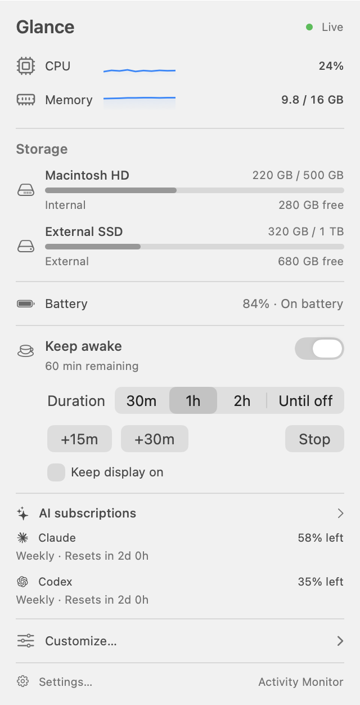
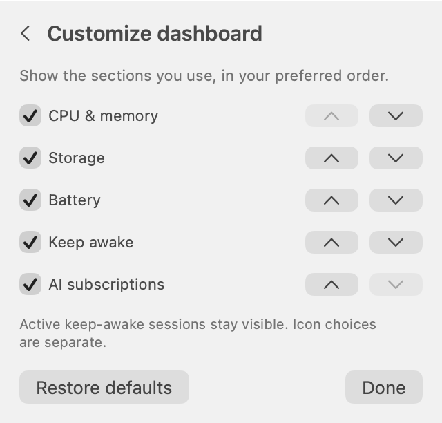
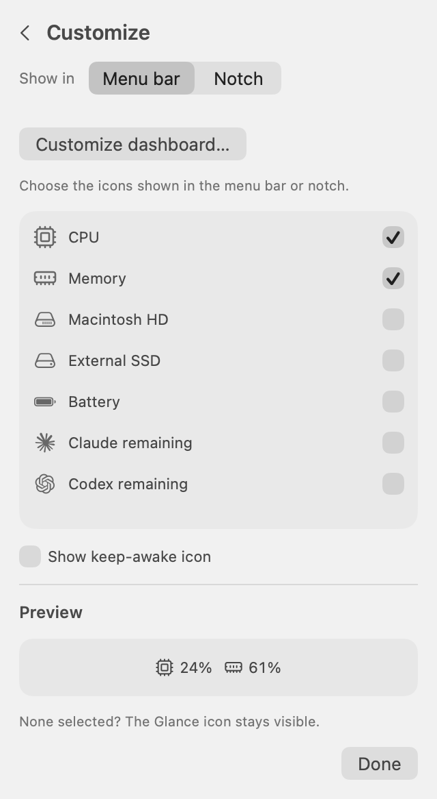

# Glance

Your Mac’s resources and AI subscription limits, in the menu bar or beside the notch.
Glance is a lightweight native macOS utility with a compact dashboard, customizable icons, and optional keep-awake sessions.
Built with Swift, AppKit, and SwiftUI, with no third-party package dependencies or telemetry.
System readings stay local; optional Claude and Codex subscription connections fetch usage directly from their providers.

**[Download Glance v1.2.5 for macOS](https://github.com/LiorNativ94/Glance/releases/download/v1.2.5/Glance-1.2.5-universal.dmg)** · [All releases](https://github.com/LiorNativ94/Glance/releases)

## Features

- **Menu bar or notch:** switch locations in Customize or Settings; only your chosen location is shown.
- **Compact notch:** selected icons sit beside the camera, within the menu-bar row, without covering browser tabs.
  Its width adjusts to your selection, and the Glance logo appears only when no selected metrics are available.
- **Shared icon selection:** choose CPU, memory, drives, and subscription limits in **Customize…**.
  The same selection applies to both display modes and persists across launches.
- **Claude and Codex usage:** reuse existing CLI sign-ins to see reported plan names, usage windows, and reset countdowns, with Claude and ChatGPT logos.
- **System monitoring:** CPU and memory history graphs and used/free space for local drives.
- **Dashboard layout:** reorder or hide CPU and memory, storage, keep awake, and AI subscription sections independently of icon choices.
- **Quiet alerts:** optional notifications for Claude and Codex task completion or required input, low AI allowance, sustained memory pressure, and low disk space.
- **Keep awake:** timed or untimed sessions, +15m / +30m extensions, an optional display sleep override, and separately authorized temporary closed-lid mode.
- **Launch at login:** optional, with no Dock icon.

## Unreleased

- Claude **Sessions** shows every Claude Code session open on this Mac, from the desktop app or a terminal, grouped by project.
  Each shows Running, Needs input, or Ready; click a desktop session or its notification to open it in Claude.
- Claude usage reads your sign-in through macOS's `security` tool, the same way Claude Code does.
  Updating or rebuilding Glance no longer asks for your Keychain password again; after one Refresh, background updates stay silent.
- Allowance meters estimate whether you will run out before the reset, for example “At this pace, runs out in 1h 20m”.
- A connection problem keeps the last reading visible, marked as last known after ten minutes; only a sign-in problem clears it.
- Glance renews an expired Claude sign-in on its own and saves it back for Claude Code, so usage stays live while you only use the Claude desktop app.
- Choose which Claude limit the menu bar or notch shows with the **Lowest / 5-hour / Weekly** picker next to **Claude remaining** in **Customize…**.

## New in v1.2.5

- Codex **Sessions** shows locally active agents, tasks needing input or approval, recent completions, and their projects.
  Click a row or notification to open that exact task in Codex; internal guardian reviews are excluded.
- Projects and sessions are ordered by the latest real interaction.
  Merely viewing a task does not move it to the top, and attention states remain visible until you respond.

## New in v1.2.4

- Click a CPU, Memory, Claude, or Codex icon or dashboard row to open its details.
  **Back to Glance** stays visible above the scrolling content.
  Click another icon to switch, the same icon to close, or press Escape/click outside.
- CPU and Memory show the top five or ten processes, sampled every two seconds while open.
  Process CPU uses 100% per logical core; memory is resident RAM and can include shared pages.
  Memory also shows pressure, swap, and compressed memory.
- Subscription **Summary** emphasizes the most constrained general allowance and its reset countdown, with expandable model/feature limits and optional Codex reset availability.
  Allowance bars fill as usage is consumed; labels show what remains.
  Amber indicates 20% or less remaining, red 10% or less.
- Enable **History** to keep local quota observations for 90 days, including observed daily increases and each period's last observed remaining allowance.
  One day appears as a reading; multiple days use labeled charts.
  Missing intervals stay unknown; disabling deletes saved history.
- Enable **Activity** to read local recorded tokens by model for Today, 7 days, or 30 days.
  Codex also groups local records by session and project.
  Main counts and charts exclude cached input; compact counts expand into exact token breakdowns, including cached reuse and total processed tokens.
  These records can span accounts on this Mac; token counts do not reveal each model's share of subscription quota.
- Both provider dashboards use your existing connection and local activity records.
  No additional sign-in is needed; website-only analytics are omitted.

## New in v1.2

- Show the limiting AI usage window and reset countdown directly in the dashboard.
- Choose alert thresholds for AI allowance and free disk space.
- Reorder or hide dashboard sections independently of menu bar icons.
- Extend timed keep-awake sessions by 15 or 30 minutes.
- Keep Alerts stable in notch mode, show permission errors inline, and center the dropdown for odd and even icon counts.

## Screenshots

Screenshots show v1.2 with sample readings, example subscription limits, and generic drive names.

<table>
  <tr>
    <th>Overview</th>
    <th>Alerts and thresholds</th>
    <th>Keep awake</th>
  </tr>
  <tr>
    <td valign="top"></td>
    <td valign="top"></td>
    <td valign="top"></td>
  </tr>
</table>

<table>
  <tr>
    <th>Dashboard layout</th>
    <th>Customize icons</th>
  </tr>
  <tr>
    <td valign="top"></td>
    <td valign="top"></td>
  </tr>
</table>

## Requirements

- macOS 14 Sonoma or later.
- An Apple Silicon or Intel Mac; the same DMG supports both.

## Install

1. Download the [v1.2.5 DMG](https://github.com/LiorNativ94/Glance/releases/download/v1.2.5/Glance-1.2.5-universal.dmg).
2. Open the DMG and drag Glance into Applications, quitting any existing copy first.
3. Open Glance from Applications.
   New installs start in the menu bar; existing installs restore the saved Menu bar or Notch choice.

No Xcode or Swift installation is needed to use the downloaded app.
The version at the bottom of **Settings…** matches the shipped app version: `1.2.5` for this release.
Open the installed copy before enabling launch at login.

Release builds use ad hoc signing and are not notarized, so macOS may block the first launch.
If you trust the download, use **System Settings → Privacy & Security → Open Anyway** after attempting to open it.
Each [GitHub Release](https://github.com/LiorNativ94/Glance/releases) includes a SHA-256 checksum alongside the DMG.

## Usage

### Quick start

1. Click Glance in the menu bar or beside the camera to open the dashboard.
2. Open **Customize… → Show in → Menu bar / Notch** to choose where Glance appears.
3. Open **Customize…** and select the metrics you want in that location.
4. To add subscription limits, connect a provider in **AI subscriptions**, then select **Claude remaining** or **Codex remaining** in **Customize…**.
   Icons show the lowest remaining limit; use the picker beside **Claude remaining** to show its 5-hour or weekly limit instead.

Choose **System**, **Light**, or **Dark** under **Settings → Appearance**.
The same appearance applies to the menu-bar and notch dashboards, including detail pages.
The notch icon strip stays black to blend with the camera area.

Connecting a provider and displaying its icon are separate choices.
Connected providers remain available in the dashboard even when their icons are unchecked.
Selections persist across launches, including disconnected drives, which reappear when remounted.
If no selected metrics are available, a small Glance button keeps the dashboard accessible.

Enable **Keep awake** for a 30-minute, one-hour, two-hour, or untimed session.
The optional **Keep display on** setting applies only while a session is active.
The menu bar cup indicator is optional and disabled by default; it is configured with **Show keep-awake icon** in **Customize…**.

Open **Settings…** to configure launch at login, alerts, or quit the app.
Lid-closed mode is available in the main dashboard’s **Keep awake** section.

### Dashboard layout and alerts

Open **Customize… → Customize dashboard…** to hide sections or move them up and down.
The order and visibility persist across launches and apply to both display modes.
Icon selections remain independent.
An active keep-awake session stays visible so its controls remain accessible.
Use **Restore defaults** to show all sections in their original order.

AI summaries show the percentage remaining, the most constrained reported window, and its reset countdown together.
Stale or expired readings offer details rather than presenting an outdated allowance as current.

Alerts are off by default.
Enable individual rules in **Settings… → Alerts…**; macOS asks for notification permission on first use.
If permission was previously denied, open **Notification settings…**, turn on **Allow notifications** for Glance, then enable the rule again.
Use the arrow controls in Alerts to choose the AI percentage remaining and the disk-space percentage and GB thresholds.
These settings save automatically and do not enable alerts by themselves.
Defaults are AI allowance at or below 20% remaining, macOS memory pressure elevated for at least one minute, or a drive with less than both 5% and 10 GB free.
The AI threshold applies to both Claude and Codex; remaining is the opposite of used (20% remaining means 80% used).
Memory pressure follows the macOS pressure signal, not RAM usage percentage.
Permission errors appear inside the active dashboard rather than in another window.
AI alerts use fresh provider readings, so they follow the existing five-minute refresh interval.
Repeated readings do not repeat an alert until the condition recovers or an AI window changes; this episode tracking lasts while Glance is running.
Click an alert to open subscription details or the current memory/storage readings, even if that section is hidden.
Disabled alerts do not request notification access, and the memory-pressure listener runs only when its alert is enabled.

During a timed keep-awake session, **+15m** and **+30m** add to the existing deadline without restarting the session.
Extensions are hidden for **Until off** sessions.
Choosing a duration preset still starts that duration from now.
Use **Stop** or the keep-awake switch to end the session.

### Notch

Choose **Customize… → Show in → Notch**, or use the same picker in **Settings…**.
Compact wings beside the camera show only the available metrics selected in **Customize…**, in the same order as the menu bar.
Connecting a subscription makes it available to select; it does not automatically add its icon.
The wings shrink to fit the selected metrics, with no extra Glance logo unless no selected metrics are available.
Percentage cells keep a stable width as readings change, so the notch resizes when you change icons rather than on every update.
The collapsed view stays entirely within the menu-bar row, leaving browser tabs and application content clear.
Click it to open the dashboard; click its header, press Escape, or click outside to collapse it.
The dropdown is centered under the entire icon strip for odd and even selections, while the camera gap stays clear.
Notch mode hides Glance’s menu bar item; choosing **Show in → Menu bar** restores it and hides the notch view.
The picker is available in Customize and Settings in both display modes, and switching moves the open page to the selected location.
Glance uses a notched display when connected, otherwise the center of the main display’s menu-bar row.
The panel follows display changes and is available across Spaces.

### Claude and Codex subscriptions

Open **AI subscriptions** from the dashboard, or **Settings… → Claude & Codex subscriptions…**.
Enable either provider to reuse its existing local sign-in.
The cards show reported plan names, session and weekly usage, and reset countdowns when those values are available.
The bars fill by **percent used**; their labels show **percent remaining**, matching the selected menu bar and notch icons for the most constrained reported limit.
For example, 14% remaining displays an 86%-filled bar.
Claude also shows Sonnet and Opus weekly windows when returned by the provider.
In **Customize…**, select **Claude remaining** or **Codex remaining** to add that provider to the menu bar or notch.
For example, a provider with 70% session usage and 40% weekly usage displays **30% remaining**.

- **Codex:** sign in with `codex login` using your ChatGPT subscription.
  Glance reads `~/.codex/auth.json`, or `$CODEX_HOME/auth.json` when that environment variable is set for Glance.
  API-key-only and Keychain-only Codex sign-ins are not supported by this connection.
- **Claude:** sign in with Claude Code.
  Glance reads `~/.claude/.credentials.json` or the `Claude Code-credentials` Keychain item.
  The Keychain item is read with macOS's `/usr/bin/security` tool, which Claude Code itself uses, so its access survives Glance updates and rebuilds.
  Background refreshes use that tool only after it has answered a **Refresh** without a prompt.
  When the sign-in expires, Glance renews it the way Claude Code does and saves it back to the same place, so both keep working.
  A custom `$CLAUDE_CONFIG_DIR` uses only that directory’s credentials file.
  The sign-in needs the `user:profile` scope; MCP-only credentials cannot supply subscription usage.
  macOS may request Keychain access when connecting or clicking **Refresh** if that tool is not already trusted.

Usage refreshes every five minutes and after wake; **Refresh** requests an update immediately unless the provider has imposed a cooldown.
Unavailable data displays a message instead of a zero-percent reading.
Connection problems, provider errors, and cooldowns keep the last reading, which is marked as last known after ten minutes; only a sign-in problem clears it.
Each meter estimates whether it will last until reset at the current average rate, once 3% of its window has passed.
Expired reset times are marked as due until a fresh reading arrives.
An expired Claude sign-in is renewed automatically; if its Keychain item still needs approval, click **Refresh** to renew it.
For other sign-in problems, renew the sign-in in its owning CLI and click **Refresh**.
Glance changes the source credentials only to save a renewed Claude sign-in, and never runs a coding session to collect usage.
These provider endpoints are undocumented and can change.
This integration follows [CodexBar’s Codex](https://github.com/steipete/CodexBar/blob/main/docs/codex.md) and [Claude](https://github.com/steipete/CodexBar/blob/main/docs/claude.md) OAuth approach; it does not require CodexBar, import browser cookies, or provide billing history.

### Troubleshooting

| What you see | What to do |
| --- | --- |
| A connected provider is missing from the notch or menu bar | Select **Claude remaining** or **Codex remaining** in **Customize…**. |
| An unwanted provider icon is visible | Uncheck it in **Customize…**; you can keep the provider connected for its dashboard card. |
| The menu bar item disappeared | Notch mode hides it; open the notch dropdown and choose **Customize… → Show in → Menu bar** to restore it. |
| A subscription shows `—` or asks you to sign in | Check its card in **AI subscriptions**, renew the CLI sign-in if requested, then click **Refresh**. |
| An alert switch stays off or says notifications are not allowed | Open **Settings… → Alerts… → Notification settings…**, allow Glance notifications in macOS, and try the switch again. |
| Refresh is waiting after too many requests | Allow the provider’s cooldown to expire; repeated clicks do not bypass it. |

## How readings work

CPU usage is calculated from the difference between successive host CPU counters across all cores.
Memory usage includes non-purgeable internal pages, wired pages, and compressed physical pages, excluding reclaimable file caches.
Memory is displayed in binary gigabytes; storage uses decimal units.

Storage covers the startup disk and visible local volumes mounted under `/Volumes`.
Read-only mounts, such as installer disk images left mounted, are excluded because their usage cannot change.
Used space is calculated as total capacity minus available capacity.
APFS shares free space between volumes, so readings may differ from Finder’s estimates of reclaimable space.

CPU, memory, and battery refresh every two seconds.
Storage refreshes every fifteen seconds and when volumes mount or unmount.
Graphs retain up to sixty seconds of readings in memory.

## Keep-awake behavior

Normal keep-awake uses IOKit power assertions and does not change persistent system settings.
Sessions end when their timer expires, the app quits, or the battery reaches ten percent while unplugged.
Sessions do not resume automatically after relaunching the app.

### Closed-lid mode

In the main dashboard’s **Keep awake** section, choose **Lid-closed mode → Set up → Enable for this session**.
Closed-lid mode requires macOS administrator authorization for each session.
The bundled helper temporarily runs `pmset -a disablesleep 1`.
This is a system-wide override that also prevents manual Sleep from the Apple menu while active.
Actual lid-close behavior depends on the Mac and its power/display configuration and should be verified on the target hardware.

The helper refuses to take over if another tool has already disabled sleep.
It checks a one-second heartbeat and restores sleep when the session ends, the app exits, the heartbeat expires, or an unplugged battery reaches ten percent.
It installs no daemon or passwordless sudo rule.
After a frozen app, restoration can take up to fifteen seconds plus the next helper check.

Force-killing the privileged helper with `SIGKILL` bypasses its cleanup.
If sleep remains disabled after a failed session, restore it with:

```sh
sudo pmset -a disablesleep 0
```

## Development and verification

```sh
swift test
./build.sh
codesign --verify --deep --strict dist/Glance.app
```

Tests cover reading calculations, metric selections, dashboard persistence, alert thresholds and repeat suppression, permission denial, timer extensions, sleep-session policy, the rendered Settings version, and visible popover positioning during menu bar customization.
Subscription tests cover provider response formats, account-scoped requests, missing and expired credentials, cooldowns, pace estimates, readings kept through temporary failures, and disconnecting during a refresh.
Native notch tests verify camera clearance, selection-based sizing, exclusive display modes, expansion, dismissal, and synthetic subscription readings.
The AppKit tests open a temporary menu bar item and popover, so run them in a logged-in macOS desktop session.
Power-controller tests briefly exercise normal keep-awake assertions; they do not authorize closed-lid mode.

For a local diagnostic snapshot:

```sh
dist/Glance.app/Contents/MacOS/Glance --diagnostics
```

Diagnostics include drive names, capacities, and volume identifiers.
Review and redact that output, screenshots, and crash reports before attaching them to a public issue.

Before submitting a change, run the tests and build, then exercise the affected controls in the bundled app.
For display changes, verify adding and removing metrics, selecting none, rapid toggling, switching between Menu bar and Notch, and reopening the panel.
Check that a connected but unselected subscription stays out of both icon views.
For sleep changes, verify stopping a session releases assertions with `pmset -g assertions` and test any closed-lid behavior on the target Mac.

## Build and run

Building from source requires a Swift 6.0 or newer toolchain, available through compatible Xcode or Command Line Tools installations.
Check your installed toolchain with `swift --version`.

From the repository directory:

```sh
./build.sh
open dist/Glance.app
```

The build script compiles the app and its sleep helper, bundles the provider logos, generates the app icon, and creates an ad hoc signed application bundle.
No Apple developer certificate is required for the local build.
The generated app is not notarized.

To keep using Glance independently of the source checkout, quit the app and copy `dist/Glance.app` into your Applications folder.
Open the installed copy before enabling launch at login.

You can also open `Package.swift` in Xcode to work on the project.
Use `build.sh` to assemble the complete app bundle, including the helper and icon resources.

## Publishing releases

Before creating or moving a release tag, add or update its exact `## vVERSION` entry in [CHANGELOG.md](CHANGELOG.md).
Write 2–4 short, single-line `- ` bullets describing user-visible changes.
Commit the changelog together with the code so both are included in the tag.
Check the release notes locally with `python3 -B scripts/release_notes.py v1.2.4`, substituting the intended version.
The release workflow stops before building if the entry is missing, duplicated, empty, or does not contain 2–4 bullets.
GitHub uses that entry for both new releases and same-tag rebuilds, replacing the release description each time.
Older tags without the required changelog entry and validation script cannot pass the updated publishing workflow.

After committing and pushing your changes, publish a new version by pushing a new tag:

```sh
git tag v1.2.1
git push origin v1.2.1
```

Use a new `vMAJOR.MINOR` or `vMAJOR.MINOR.PATCH` tag for each version, such as `v1.2.1` or `v1.3`.
Prerelease suffixes such as `-beta.1` are not supported.
The **Release DMG** GitHub Actions workflow tests the tagged code, builds both architectures, stamps the app version from the tag, verifies the signatures and DMG, and publishes a GitHub Release with the DMG and its SHA-256 checksum.
The version at the bottom of Settings reads that same bundled version automatically.
The rendered Settings, metric dashboard, and popover alignment tests require an interactive desktop and run locally rather than in release CI.
No repository secrets are required; the workflow uses GitHub's built-in token with `contents: write` permission.
Repository or organization policy must allow GitHub Actions and that permission.
To build an existing tag manually, open **Actions → Release DMG → Run workflow** on `main` and enter the tag, such as `v1.2`.

To build the same DMG locally with Xcode installed:

```sh
./package-dmg.sh v1.2
```

The output is `dist/Glance-1.2-universal.dmg` and its `.sha256` checksum file.

## Project layout

| Path | Purpose |
| --- | --- |
| `Sources/Glance` | Menu bar and notch hosting, SwiftUI interface, preferences, subscription connections, and session controls. |
| `Sources/Glance/Resources` | Claude and ChatGPT vector logos and their attribution. |
| `Sources/GlanceCore` | System sampling, volume identity, usage parsing, formatting, and sleep-lease policy. |
| `Sources/GlancePowerHelper` | Session-scoped privileged sleep helper. |
| `Resources` | App metadata, icon generation, and third-party notices. |
| `Tests` | Core, subscription, power, display-mode, and native layout regression tests. |
| `build.sh` | Release compilation, app assembly, and local code signing. |
| `package-dmg.sh` | Universal app build, version stamping, and DMG packaging. |
| `.github/workflows/release.yml` | Version tag builds and GitHub Release publication. |

## Privacy and repository hygiene

Glance processes system readings locally.
Metric selections and the optional cup indicator are stored in macOS user defaults, outside the repository.
Notch visibility, dashboard layout, alert thresholds, enabled alert rules, and enabled subscription providers are also stored in user defaults.
Subscription connections are off by default and read local credentials only for enabled providers.
Access tokens are sent only to the corresponding provider’s fixed HTTPS usage endpoint; redirects are refused.
An expired Claude sign-in’s refresh token is sent only to Claude’s fixed HTTPS token endpoint, and the renewed sign-in replaces the stored one where Claude Code keeps it.
Glance stores no copies of credentials or usage readings on disk, and background Keychain reads never prompt.
The only related preference is whether the `security` tool has answered silently before.
Closed-lid sessions use temporary local heartbeat and status files.
Administrator authorization is handled by macOS; the app does not store an administrator password.

The repository excludes build products, application bundles, local editor state, environment files, signing material, and diagnostic output through `.gitignore`.
Ignoring a file does not remove it from existing Git history.
Review staged changes and commit author metadata before publishing, and use a GitHub no-reply email if you want to keep your personal email private.

## Third-party notices

CPU and memory glyphs are adapted from Lucide icons.
Their ISC license and attribution are included in [Resources/Lucide-LICENSE.txt](Resources/Lucide-LICENSE.txt).
Claude and ChatGPT logo assets are sourced from CodexBar and retain their [MIT notice](Sources/Glance/Resources/CodexBar-LICENSE.txt).
The logos identify their respective providers and remain their owners’ trademarks.
These notices cover the attributed assets; they do not license the entire project.
